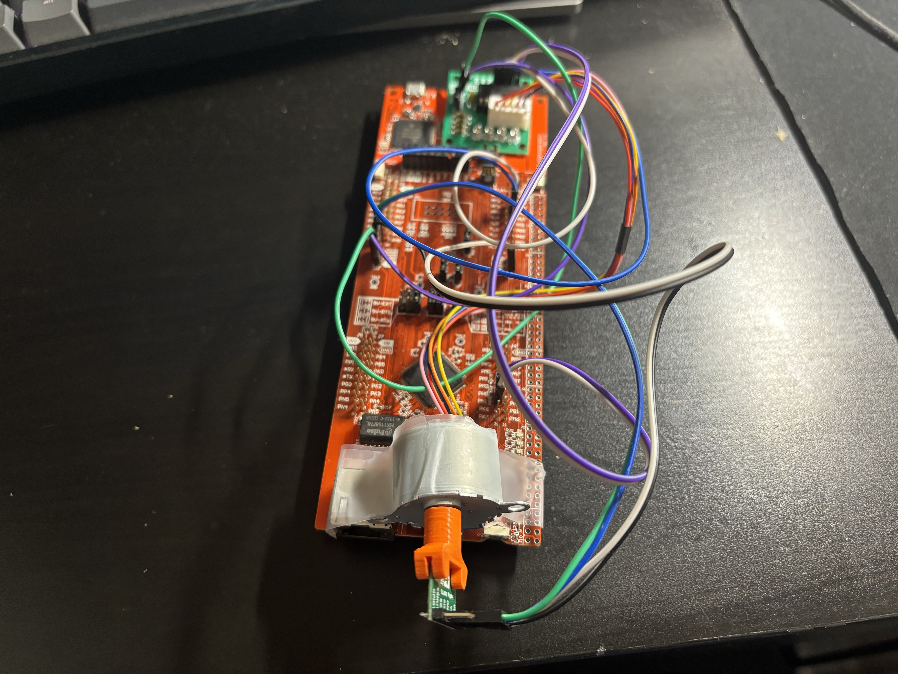

# Spatial-Mapping-Lidar-Detection-System

The objective of this project is attempting to recreate a physical environment with a virtual simulation. This is done by using the a Time of Flight (ToF) Sensor, a stepper motor, the VL53L1X driver board and the MSP432E401Y Microcontroller to collect real time information about the surrounding environment. From there, it employees a python script to generate a virtual representation of the environment. 




# Hardware Set up
In order to accurately set up this device, please follow the pin diagram as listed below


# Software Set up
Ensure that you are running Python 3.8.10. The Open3D and pyserial dependencies is used for this project. To install these, run the following commands:

```bash
pip install open3d pyserial
```

Additionally, the microcontroller is also programmed using C in the KEIL IDE enviorment, thus it is recomended that the same enviorment is used to flash the program onto the microcontroller. 

# Application
Once the circuit has been designed, perform the following in a sequential order
1. Download the Keil Project and Python script required.
2. Plug in microcontroller to the computer via the usb cable.
3. Open Keil software and change “numberOfScans” to users specifications.
4. Save the program and flash the microcontroller with the code.
5. Open the python script and change the “NUMBEROFSCANS” to be the same value as provided in step 3.
6. In the python script, change the “SPACING” measurement to users specifications.
7. Open device manager and navigate to Ports to identify which port has enabled UART (will be shown as COMX (UART))
8. Change line 8 in the python file to the same COM port as specified in the users device manager
9. After configuration, the users can run the python script by typing

```bash
python Data Visualization/project.py
```
    
11. Once this has been done, the user may press the reset button on the microcontroller to complete the flashing process.
12. The user must press on board button PJ1 to begin the scanning process.
13. Once the scanning procedure is complete, a 3D visualization of the user's environment will appear on the computer screen, signifying the end of the process. 

# Results
An example of its usage can be displayed below, where it had been used to scan a hallway with a high degree of accuracy. 


